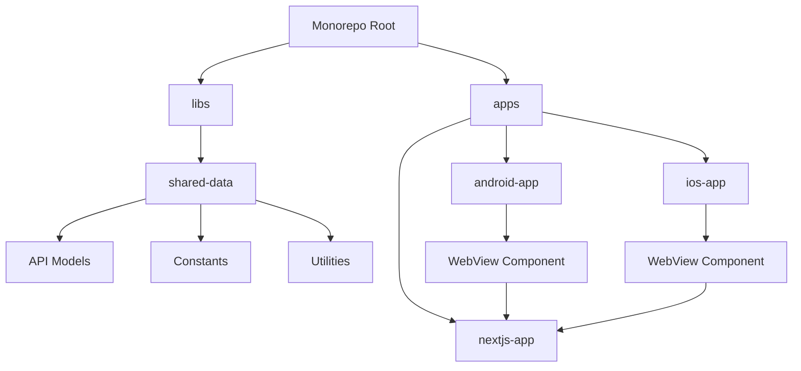
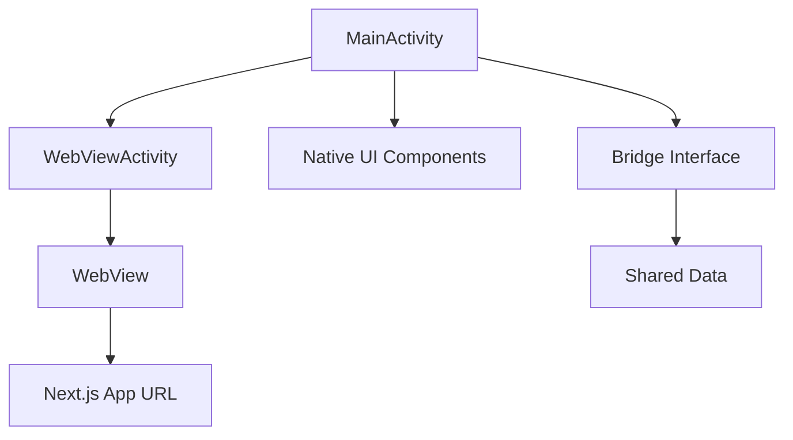
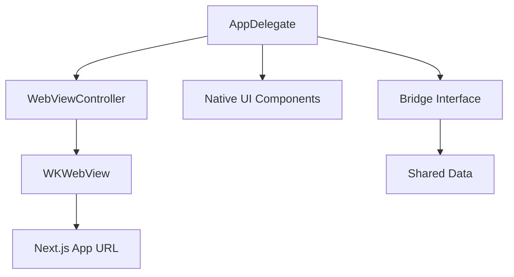
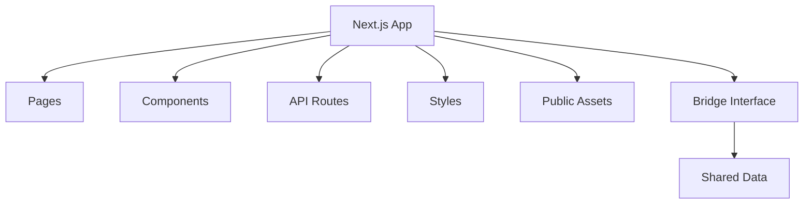
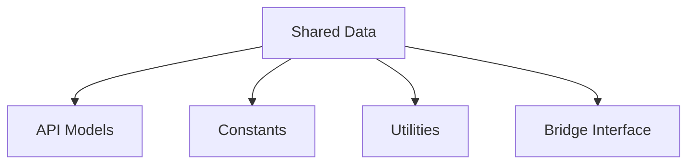
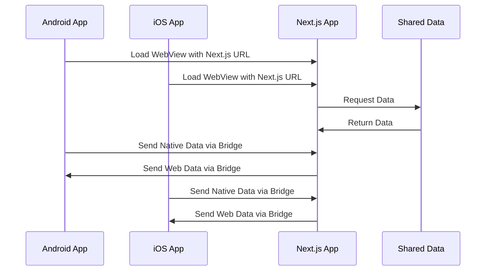

# Hybrid Mobile Webapp Architecture Plan

## 1. Overall Architecture



## 2. Component Structure

### 2.1. Android Native App (Java/Kotlin)

The Android app will be a native application with a WebView component that loads the Next.js webapp.



### 2.2. iOS Native App (Swift)

The iOS app will be a native application with a WebView component that loads the Next.js webapp.



### 2.3. Next.js Web App

The Next.js app will be a responsive web application that can be loaded in the WebViews of the native apps.



### 2.4. Shared Data Library

The shared data library will contain common code and data models that can be used by all three apps.



## 3. Communication Flow



## 4. Implementation Plan

### 4.1. Android Native App

1. **Setup Android Project Structure**

   - Create standard Android project structure with Gradle
   - Configure WebView in MainActivity
   - Implement JavaScript bridge for communication with Next.js app

2. **WebView Implementation**

   - Configure WebView to load Next.js app URL
   - Enable JavaScript and DOM storage
   - Handle navigation and error states

3. **Bridge Interface**
   - Create JavaScript interface for communication between WebView and native code
   - Implement methods for data exchange

### 4.2. iOS Native App

1. **Setup iOS Project Structure**

   - Create standard iOS project structure with Swift
   - Configure WKWebView in main ViewController
   - Implement JavaScript bridge for communication with Next.js app

2. **WebView Implementation**

   - Configure WKWebView to load Next.js app URL
   - Enable JavaScript and DOM storage
   - Handle navigation and error states

3. **Bridge Interface**
   - Create WKScriptMessageHandler for communication between WebView and native code
   - Implement methods for data exchange

### 4.3. Next.js Web App

1. **Setup Next.js Project**

   - Configure Next.js with TypeScript
   - Set up pages, components, and API routes
   - Implement responsive design for mobile WebViews

2. **Bridge Interface**

   - Create JavaScript functions for communication with native apps
   - Implement detection of WebView environment
   - Adapt UI based on platform (Android/iOS/Web)

3. **API Integration**
   - Create API routes for data exchange
   - Implement data fetching with SWR or React Query

### 4.4. Shared Data Library

1. **Setup Shared Library**

   - Configure TypeScript for type sharing
   - Create data models and interfaces
   - Implement utility functions

2. **Bridge Interface**
   - Define communication protocol between apps
   - Create serialization/deserialization utilities
   - Implement platform-specific adapters

## 5. Build and Deployment

### 5.1. Development Workflow

1. **Local Development**

   - Run Next.js app locally
   - Configure Android and iOS apps to point to local Next.js server
   - Use hot reloading for rapid development

2. **Testing**
   - Implement unit tests for each app
   - Create integration tests for WebView communication
   - Test on multiple devices and browsers

### 5.2. Production Deployment

1. **Next.js App Deployment**

   - Deploy to Vercel, Netlify, or custom server
   - Configure for optimal performance

2. **Native Apps Deployment**
   - Configure to point to production Next.js URL
   - Package for app stores
   - Implement CI/CD pipeline

## 6. Directory Structure

```
/
├── package.json
├── pnpm-workspace.yaml
├── apps/
│   ├── android-app/
│   │   ├── src/
│   │   │   ├── main/
│   │   │   │   ├── java/
│   │   │   │   │   └── com/
│   │   │   │   │       └── example/
│   │   │   │   │           ├── MainActivity.java
│   │   │   │   │           └── WebViewActivity.java
│   │   │   │   ├── res/
│   │   │   │   │   └── layout/
│   │   │   │   │       ├── activity_main.xml
│   │   │   │   │       └── activity_webview.xml
│   │   │   │   └── AndroidManifest.xml
│   │   │   └── build.gradle
│   │   └── package.json
│   ├── ios-app/
│   │   ├── AppDelegate.swift
│   │   ├── WebViewController.swift
│   │   ├── Main.storyboard
│   │   ├── Info.plist
│   │   └── package.json
│   └── nextjs-app/
│       ├── pages/
│       │   ├── index.js
│       │   ├── api/
│       │   │   └── data.js
│       │   └── _app.js
│       ├── components/
│       │   └── Bridge.js
│       ├── styles/
│       │   └── globals.css
│       ├── public/
│       │   └── assets/
│       └── package.json
└── libs/
    └── shared-data/
        ├── models/
        │   └── index.js
        ├── constants/
        │   └── index.js
        ├── utils/
        │   └── index.js
        ├── bridge/
        │   └── index.js
        ├── index.js
        └── package.json
```
